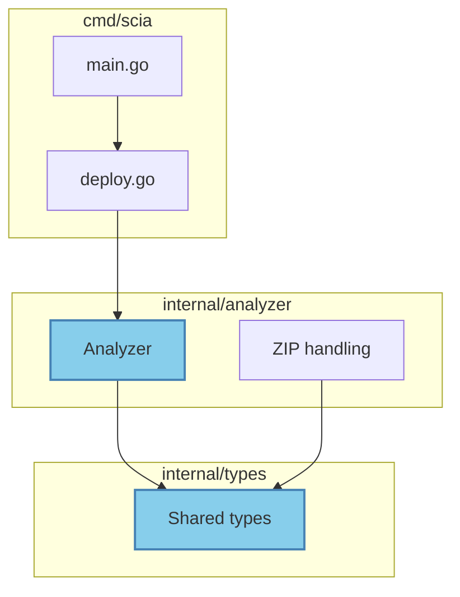
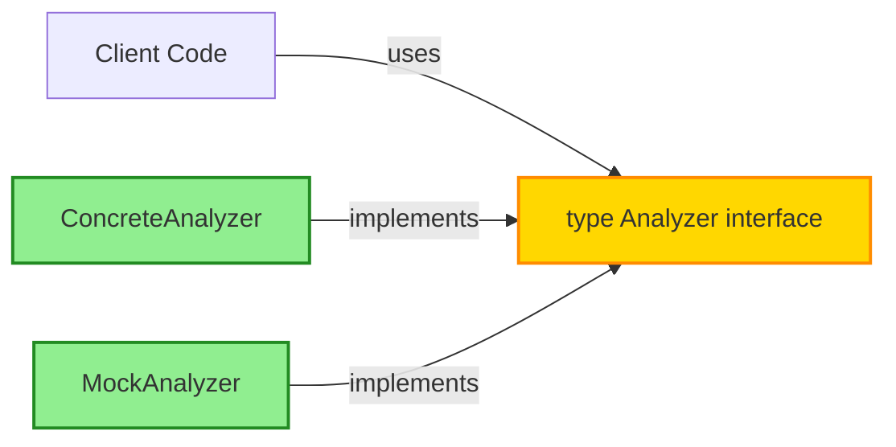
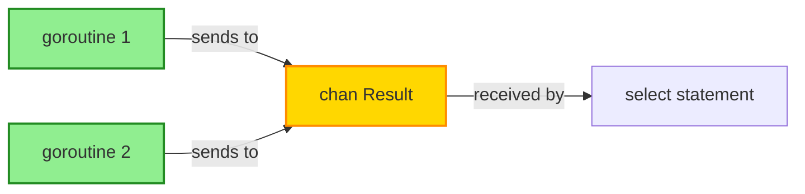

# Claude Code Command: Create Go Pull Request

This command creates a detailed Pull Request tailored for Go projects, including:
- PR type classification (conventional commits)
- Go-specific architectural diagrams (packages, interfaces, concurrency)
- File-by-file walkthrough with Go idioms analysis
- Test coverage and benchmark impact
- Breaking changes detection

## Instructions

**CRITICAL**: Use context7 to understand the Go project structure, package relationships, and idioms BEFORE generating the PR description.

You MUST follow these steps in order:

### 1. Gather Context with Context7

Before analyzing the diff, search for:
- **Package architecture**: `package ` to understand module structure
- **Interface definitions**: `type.*interface` to identify contracts
- **Public APIs**: exported functions and types (capitalized names)
- **Test patterns**: `_test.go` files to understand test conventions
- **CLAUDE.md**: Project-specific Go conventions and patterns

### 2. Analyze Go-Specific Changes

Run these commands to understand the PR:

```bash
# Get current branch and base
CURRENT_BRANCH=$(git branch --show-current)
BASE_BRANCH="${1:-main}"

# Get commit history with conventional commits
git log origin/$BASE_BRANCH..HEAD --oneline --format="%s"

# Get diff statistics
git diff origin/$BASE_BRANCH...HEAD --stat

# Get full diff
DIFF=$(git diff origin/$BASE_BRANCH...HEAD)

# Detect Go-specific changes
echo "$DIFF" | grep -E "^[\+\-].*func |^[\+\-].*type |^[\+\-].*interface|^[\+\-].*package " || true

# Check if go.mod changed
git diff origin/$BASE_BRANCH...HEAD go.mod go.sum 2>/dev/null || echo "No dependency changes"

# Run tests to ensure PR is ready
task test || go test ./... -short

# Run linter
task lint || echo "Linting skipped"
```

### 3. Determine PR Type

Based on Go conventions:
- `feat`: New exported API, new package, new feature
- `fix`: Bug fix in existing code
- `perf`: Performance improvement (show benchmark results)
- `refactor`: Code restructuring without behavior change
- `test`: Test additions/improvements
- `docs`: Documentation (godoc comments, README)
- `build`: go.mod/go.sum changes, build system
- `ci`: GitHub Actions, Dagger changes

### 4. Generate Go-Focused PR Description

Create a comprehensive description:

```markdown
## 🔍 PR Type: [type]

**Conventional Commit Type**: `[type]`

## 📝 Summary

[2-3 sentences explaining WHAT changed and WHY. Use Go terminology: packages, interfaces, goroutines, channels, etc.]

## 🎯 Changes Overview

### Core Changes
- **[Package/Component]**: Brief description using Go idioms
- **[Package/Component]**: Brief description
- **[Package/Component]**: Brief description

### Go-Specific Impacts
- **New exported APIs**: [List if any]
- **Breaking changes**: [List if any]
- **Deprecated APIs**: [List if any]
- **Performance**: [Impact on benchmarks]

## 📊 Go Architecture Diagram

\```mermaid
flowchart TB
    subgraph "Package: [package-name]"
        newType["type NewStruct"]:::new
        newFunc["func NewFunction"]:::new
        existingType["type ExistingStruct"]
    end

    subgraph "Package: [another-package]"
        interface["type Interface interface"]:::modified
        impl["Implementation"]
    end

    subgraph "External Dependencies"
        ext["github.com/pkg/module"]
    end

    newFunc -- "returns" --> newType
    newType -- "implements" --> interface
    interface -- "used by" --> impl
    impl -- "imports" --> ext

    classDef new fill:#90EE90,stroke:#228B22,stroke-width:2px
    classDef modified fill:#FFD700,stroke:#FF8C00,stroke-width:2px
    classDef exported fill:#87CEEB,stroke:#4682B4,stroke-width:2px
\```

**Diagram Legend**:
- 🟢 Green: New types/functions/packages
- 🟡 Yellow: Modified exports
- 🔵 Blue: Public APIs (exported)
- ⚪ White: Existing unchanged code

### Go Idioms Applied

- ✅ **Error handling**: Errors returned as values, not panics
- ✅ **Concurrency**: Goroutines communicate via channels
- ✅ **Zero values**: Types usable without explicit initialization
- ✅ **Small interfaces**: Interfaces with 1-3 methods
- ✅ **Accept interfaces, return structs**: Flexible APIs
- ✅ **No "Get" prefix**: Follow Go getter conventions

## 🗂️ File Changes Walkthrough

| File | Type | LoC | Go Impact | Description |
|------|------|-----|-----------|-------------|
| `pkg/analyzer/analyzer.go` | Modified | +50/-30 | ✨ Exported | Added `Analyzer` struct with public methods |
| `internal/helper/util.go` | Added | +120 | 🔒 Internal | Private utility functions |
| `pkg/types/types.go` | Modified | +20/-5 | 💥 Breaking | Changed `Analysis` struct fields |
| `go.mod` | Modified | +3/-2 | 📦 Deps | Updated dependencies |

<details>
<summary><b>📄 Detailed File-by-File Analysis</b></summary>

### 📦 Package: `internal/analyzer`

#### `internal/analyzer/analyzer.go` (+50/-30)

**Purpose**: Core repository analysis logic

**Go Changes**:
- ✨ **New Exported Type** (L15-25):
  \```go
  type Analyzer struct {
      workDir string
      verbose bool
  }
  \```
  **Idiom**: Unexported fields, exported type. Zero value not usable (requires constructor).

- ✨ **New Constructor** (L27-32):
  \```go
  func NewAnalyzer(workDir string, verbose bool) *Analyzer
  \```
  **Idiom**: Returns pointer for mutation. Clear parameter names.

- 🔧 **Modified Method** (L43-68):
  Changed `detectFramework` from exported to unexported.
  **Idiom**: Unexport internal methods (lowercase first letter).

**Impact**: Creates new public API for analyzer package. Maintains backward compatibility.

---

#### `internal/analyzer/zip.go` (+80)

**Purpose**: ZIP file extraction and analysis

**Go Security**:
- ✅ Zip slip protection (L113-117)
- ✅ Directory permissions 0750 (not 0755)
- ✅ Error wrapping with `fmt.Errorf` and `%w`

**Go Best Practices**:
- ✅ Named return values avoided (clarity over brevity)
- ✅ Error checks before defer
- ✅ Context-aware errors: `fmt.Errorf("failed to extract %s: %w", file.Name, err)`

---

### 📦 Package: `cmd`

#### `cmd/root.go` (+15/-2)

**Purpose**: Cobra CLI root command

**Go Changes**:
- ✨ **Added version info** (L36-42):
  \```go
  func SetVersionInfo(v, c, d, b string)
  \```
  **Idiom**: Simple setter, clear single-letter params acceptable for version/commit/date.

- 🔧 **Fixed error handling** (L62-63):
  Changed from ignored errors to explicit blank assignment: `_ = viper.BindPFlag(...)`
  **Idiom**: Explicit about intentionally ignored errors.

**Impact**: Enables GoReleaser version injection. No breaking changes.

---

### 📦 Dependencies: `go.mod`

#### Changes
- ⬆️ **Updated Go version**: 1.24 → 1.25
- ➕ **No new dependencies added**
- ✅ **All indirect dependencies up to date**

**Go 1.25 Benefits**:
- DWARF5 debug info (smaller binaries)
- Improved slice stack allocation
- Container-aware GOMAXPROCS

</details>

## 📊 Test Coverage

### Test Changes
\```bash
# Run tests
task test

# With coverage
go test ./... -cover -coverprofile=coverage.out
go tool cover -func=coverage.out
\```

**Coverage Impact**:
- **Before**: X% coverage
- **After**: Y% coverage (+Z%)
- **New tests**: [count] test functions added
- **Table-driven tests**: Yes/No

### Test Files Modified
- [ ] `internal/analyzer/analyzer_test.go` - Unit tests for analyzer
- [ ] `internal/analyzer/zip_test.go` - ZIP extraction tests
- [ ] Integration tests needed for end-to-end flows

## ⚡ Performance Impact

### Benchmarks
\```bash
# Run benchmarks
task bench
# Or
go test -bench=. -benchmem ./...
\```

**Expected Impact**:
- **Memory**: [No change / +X% / -X%]
- **Allocations**: [No change / +X / -X per operation]
- **Speed**: [No change / +X% faster / -X% slower]

### Profiling
- [ ] CPU profiling done
- [ ] Memory profiling done
- [ ] Trace analysis done

## 💥 Breaking Changes

### API Changes

**BREAKING**: `Analysis` struct field changes

**Before**:
\```go
type Analysis struct {
    EnvVars []string  // Old: slice of strings
}
\```

**After**:
\```go
type Analysis struct {
    EnvVars map[string]string  // New: map for key-value pairs
}
\```

**Migration**:
\```go
// Old usage
for _, env := range analysis.EnvVars {
    fmt.Println(env)
}

// New usage
for key, value := range analysis.EnvVars {
    fmt.Printf("%s=%s\n", key, value)
}
\```

## 🔒 Security & Go Safety

### Security Checks
- ✅ No SQL injection (parameterized queries)
- ✅ No hardcoded secrets
- ✅ Input validation on user-provided paths
- ✅ Directory traversal prevention (zip slip)
- ✅ Proper error wrapping (no info leaks)

### Go-Specific Safety
- ✅ No data races (checked with `-race` flag)
- ✅ Context cancellation handled
- ✅ Goroutine leaks prevented
- ✅ Channel closing done by sender only
- ✅ Mutex locks paired with unlocks

### gosec Findings
\```bash
# Security scan
golangci-lint run --enable=gosec
\```
- No critical issues
- Minor: [List any warnings with nolint justification]

## 📚 Documentation

### Godoc Comments
- ✅ All exported types documented
- ✅ All exported functions documented
- ✅ Package documentation in doc.go
- ✅ Examples added where helpful

### Example Usage
\```go
// Example: Create and use analyzer
analyzer := analyzer.NewAnalyzer("/tmp/work", true)
result, err := analyzer.Analyze("https://github.com/user/repo")
if err != nil {
    return fmt.Errorf("analysis failed: %w", err)
}
fmt.Printf("Framework: %s\n", result.Framework)
\```

### Documentation Files
- [ ] README.md updated
- [x] CLAUDE.md updated (Go 1.25 best practices added)
- [ ] API docs regenerated
- [ ] IMPLEMENTATION_STATUS.md updated

## 🏷️ Suggested Labels

`enhancement`, `go1.25`, `breaking-change`, `needs-review`, `documentation`

## 📋 Go-Specific Checklist

### Code Quality
- [ ] All exports have godoc comments
- [ ] No exported functions return unexported types
- [ ] Errors use `%w` for wrapping, not `%v`
- [ ] Variable names follow Go conventions (short, clear)
- [ ] No "Get" prefix on getters
- [ ] Interfaces are small (1-3 methods)
- [ ] Accept interfaces, return structs

### Testing
- [ ] Tests use table-driven pattern where applicable
- [ ] Test names follow `TestFunctionName` convention
- [ ] Benchmarks use `b.ReportAllocs()` for memory tracking
- [ ] Race detector passes: `go test -race ./...`
- [ ] Coverage above 80% for new code

### Performance
- [ ] No unnecessary allocations in hot paths
- [ ] Defer not used in loops
- [ ] Sync.Pool used for reusable objects if needed
- [ ] String concatenation uses strings.Builder for loops

### Concurrency
- [ ] Goroutines have clear lifecycle
- [ ] Channels closed by sender
- [ ] WaitGroups or errgroup used for coordination
- [ ] Context used for cancellation

### Build & CI
- [ ] `go mod tidy` run
- [ ] `task lint` passes
- [ ] `task test` passes
- [ ] `task build` succeeds
- [ ] No new golangci-lint warnings

## 🔗 Related Issues

Closes #[issue-number]
Relates to #[issue-number]

---

**Generated with Claude Code** - Go-aware PR analysis
```

### 5. Create the Pull Request

Execute these commands:

```bash
# Get current branch
CURRENT_BRANCH=$(git branch --show-current)
BASE_BRANCH="${1:-main}"

# Ensure we're not on main/base branch
if [ "$CURRENT_BRANCH" = "$BASE_BRANCH" ]; then
    echo "❌ Error: Cannot create PR from $BASE_BRANCH branch"
    echo "Please create a feature branch first: git checkout -b feature/your-feature"
    exit 1
fi

# Ensure all changes are committed
if ! git diff --quiet; then
    echo "⚠️ Warning: You have uncommitted changes"
    echo "Please commit or stash them first"
    exit 1
fi

# Run pre-PR checks
echo "🔍 Running pre-PR checks..."
go mod tidy
task lint || echo "⚠️ Linting had issues"
task test || echo "⚠️ Tests had failures"

# Push branch
echo "📤 Pushing branch..."
git push -u origin $CURRENT_BRANCH

# Generate PR title from commits
PR_TITLE=$(git log origin/$BASE_BRANCH..HEAD --format=%s | head -1)

# Create PR with generated description
echo "📝 Creating Pull Request..."
gh pr create \
  --base $BASE_BRANCH \
  --head $CURRENT_BRANCH \
  --title "$PR_TITLE" \
  --body "[Insert the full markdown description generated above]" \
  --web
```

### 6. Post-Creation Actions

```bash
# Get PR number
PR_NUM=$(gh pr view --json number -q '.number')

# Add labels if suggested
gh pr edit $PR_NUM --add-label "enhancement,go1.25"

# Request reviewers (if configured)
# gh pr edit $PR_NUM --add-reviewer @team/go-reviewers

echo "✅ PR #$PR_NUM created successfully!"
echo "🔗 $(gh pr view $PR_NUM --json url -q '.url')"
```

## Guidelines for Go-Specific Quality

### Mermaid Diagrams for Go

**Package Relationships**:


**Interface Implementation**:


**Concurrency Patterns**:


### Go Idiom Checklist

When reviewing changes, verify:

**Naming**:
- ✅ Package names: lowercase, single word
- ✅ Exported: CapitalCase (e.g., `Analyzer`, `NewClient`)
- ✅ Unexported: camelCase (e.g., `workDir`, `detectFramework`)
- ✅ No "Get" prefix on getters
- ✅ Acronyms all caps in names: `HTTP`, `URL`, `ID`

**Error Handling**:
- ✅ Return errors, don't panic
- ✅ Wrap errors with context: `fmt.Errorf("operation failed: %w", err)`
- ✅ Check errors immediately after function calls
- ✅ Named error variables lowercase: `var errNotFound = errors.New(...)`

**Interfaces**:
- ✅ Small interfaces (1-3 methods)
- ✅ Named with "-er" suffix: `Reader`, `Writer`, `Analyzer`
- ✅ Accept interfaces, return structs
- ✅ Don't create interfaces before you need them

**Concurrency**:
- ✅ Share memory by communicating (use channels)
- ✅ Close channels only from sender
- ✅ Use `sync.WaitGroup` or `errgroup` for coordination
- ✅ Pass context.Context as first parameter

**Performance**:
- ✅ Avoid defer in loops
- ✅ Use `strings.Builder` for string concatenation
- ✅ Reuse buffers with `sync.Pool` if needed
- ✅ Profile before optimizing

## Error Handling

**No commits to create PR from**:
```bash
echo "❌ No commits found between $BASE_BRANCH and $CURRENT_BRANCH"
echo "Please make some commits first"
exit 1
```

**On main/base branch**:
```bash
echo "❌ You're on $CURRENT_BRANCH branch"
echo "Create a feature branch first:"
echo "  git checkout -b feat/your-feature-name"
exit 1
```

**Tests failing**:
```bash
echo "⚠️ Tests are failing"
echo "Fix tests before creating PR, or create draft PR:"
echo "  gh pr create --draft ..."
```

**Not authenticated with gh**:
```bash
echo "❌ GitHub CLI not authenticated"
echo "Run: gh auth login"
exit 1
```

## Example Usage

```bash
# Create PR against main branch
/create-pr

# Create PR against develop branch
/create-pr develop

# Create PR against feature branch
/create-pr feature/base-branch
```

---

**Remember**:
- Use context7 to understand Go package structure FIRST
- Focus on Go idioms and conventions
- Highlight breaking API changes prominently
- Show benchmark/performance impacts
- Verify tests pass before creating PR
- Include migration guides for breaking changes
