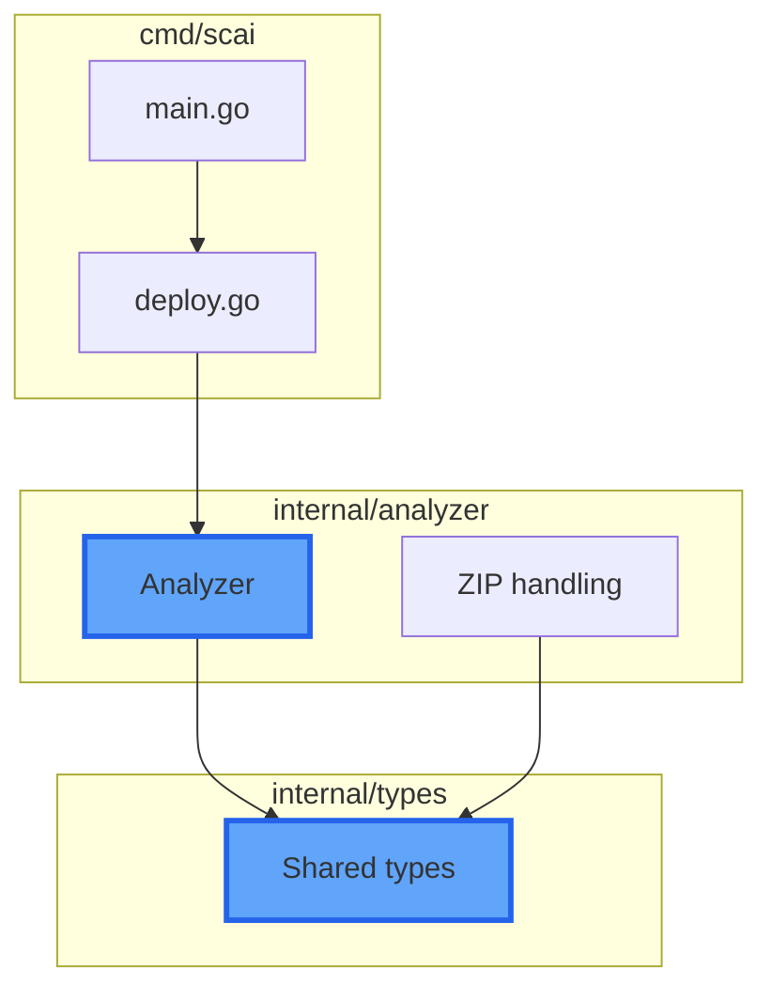
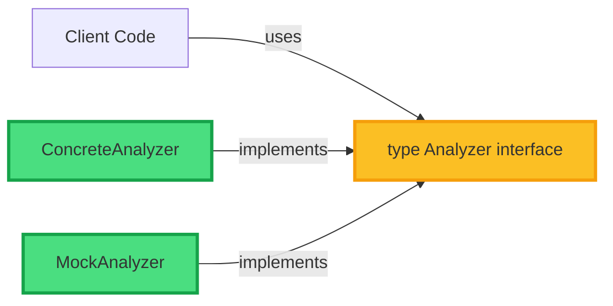
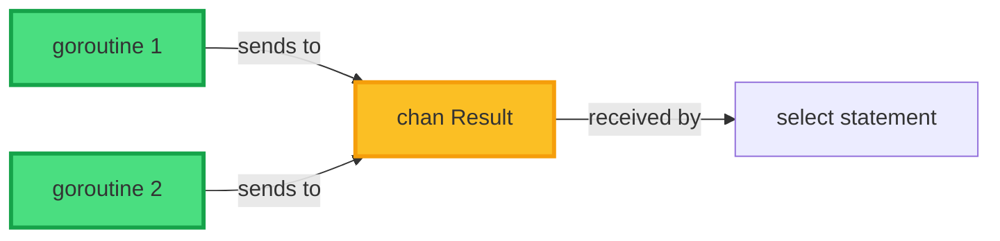

# Claude Code Command: Create Go Pull Request

This command creates a detailed Pull Request tailored for Go projects, including:
- PR type classification (conventional commits)
- Go-specific architectural diagrams (packages, interfaces, concurrency)
- File-by-file walkthrough with Go idioms analysis
- Test coverage and benchmark impact
- Breaking changes detection

## Instructions

**CRITICAL**: Use context7 to understand the Go project structure, package relationships, and idioms BEFORE generating the PR description.

You MUST follow these steps in order:

### 1. Gather Context with Context7

Before analyzing the diff, search for:
- **Package architecture**: `package ` to understand module structure
- **Interface definitions**: `type.*interface` to identify contracts
- **Public APIs**: exported functions and types (capitalized names)
- **Test patterns**: `_test.go` files to understand test conventions
- **CLAUDE.md**: Project-specific Go conventions and patterns

### 2. Analyze Go-Specific Changes

Run these commands to understand the PR:

```bash
# Get current branch and base
CURRENT_BRANCH=$(git branch --show-current)
BASE_BRANCH="${1:-main}"

# Get commit history with conventional commits
git log origin/$BASE_BRANCH..HEAD --oneline --format="%s"

# Get diff statistics
git diff origin/$BASE_BRANCH...HEAD --stat

# Get full diff
DIFF=$(git diff origin/$BASE_BRANCH...HEAD)

# Detect Go-specific changes
echo "$DIFF" | grep -E "^[\+\-].*func |^[\+\-].*type |^[\+\-].*interface|^[\+\-].*package " || true

# Check if go.mod changed
git diff origin/$BASE_BRANCH...HEAD go.mod go.sum 2>/dev/null || echo "No dependency changes"

# Run tests to ensure PR is ready
task test || go test ./... -short

# Run linter
task lint || echo "Linting skipped"
```

### 3. Determine PR Type

Based on Go conventions:
- `feat`: New exported API, new package, new feature
- `fix`: Bug fix in existing code
- `perf`: Performance improvement (show benchmark results)
- `refactor`: Code restructuring without behavior change
- `test`: Test additions/improvements
- `docs`: Documentation (godoc comments, README)
- `build`: go.mod/go.sum changes, build system
- `ci`: GitHub Actions, Dagger changes

### 4. Generate Go-Focused PR Description

Create a concise but informative description:

```markdown
## 🔍 Type: `[type]`

## 📝 Summary

[1-2 sentences explaining WHAT changed and WHY]

## 🎯 Key Changes

- **[Component]**: Brief description
- **[Component]**: Brief description
- **[Component]**: Brief description

**Impacts**: [New APIs / Breaking changes / Performance changes if any]

## 📊 Go Architecture Diagram

\```mermaid
flowchart TB
    subgraph "Package: [package-name]"
        newType["type NewStruct"]:::new
        newFunc["func NewFunction"]:::new
        existingType["type ExistingStruct"]
    end

    subgraph "Package: [another-package]"
        interface["type Interface interface"]:::modified
        impl["Implementation"]
    end

    subgraph "External Dependencies"
        ext["github.com/pkg/module"]
    end

    newFunc -- "returns" --> newType
    newType -- "implements" --> interface
    interface -- "used by" --> impl
    impl -- "imports" --> ext

    classDef new fill:#4ADE80,stroke:#16A34A,stroke-width:3px
    classDef modified fill:#FBBF24,stroke:#F59E0B,stroke-width:3px
    classDef exported fill:#60A5FA,stroke:#2563EB,stroke-width:3px
\```

**Diagram Legend**:
- 🟢 Green: New types/functions/packages
- 🟡 Yellow: Modified exports
- 🔵 Blue: Public APIs (exported)
- ⚪ White: Existing unchanged code

### Go Idioms Used

✅ Error handling • ✅ Concurrency • ✅ Small interfaces • ✅ Accept interfaces, return structs

## 🗂️ Files Changed

| File | Lines | Impact | Description |
|------|-------|--------|-------------|
| `pkg/analyzer/analyzer.go` | +50/-30 | ✨ API | Added `Analyzer` struct |
| `internal/helper/util.go` | +120 | Internal | Private utilities |
| `pkg/types/types.go` | +20/-5 | 💥 Breaking | Modified `Analysis` struct |

<details>
<summary><b>📄 Detailed Changes (expand if needed)</b></summary>

### `internal/analyzer/analyzer.go` (+50/-30)
**Purpose**: Core repository analysis

**Changes**:
- ✨ New `Analyzer` struct (exported type, unexported fields)
- ✨ New constructor `NewAnalyzer(workDir, verbose)`
- 🔧 Unexported `detectFramework` (was exported)

**Impact**: New public API, maintains backward compatibility

---

### `internal/analyzer/zip.go` (+80)
**Purpose**: ZIP extraction and analysis

**Highlights**:
- ✅ Zip slip protection
- ✅ Secure permissions (0750)
- ✅ Proper error wrapping with `%w`

---

### `cmd/root.go` (+15/-2)
**Changes**:
- ✨ Added `SetVersionInfo()` for GoReleaser
- 🔧 Explicit error ignoring with `_`

---

### `go.mod` (+3/-2)
- ⬆️ Go 1.24 → 1.25 (DWARF5, better allocations)
- ✅ All dependencies up to date

</details>

## 📊 Testing

**Coverage**: [Before → After] | **New tests**: [count] | **Commands**: `task test`, `task bench`

## 💥 Breaking Changes

[List any breaking API changes with brief migration guide]

## 🔒 Security

- ✅ No data races (`-race` flag passed)
- ✅ Input validation
- ✅ No hardcoded secrets
- ✅ gosec passed

## 📋 Checklist

- [ ] `task lint` passes
- [ ] `task test` passes
- [ ] `task build` succeeds
- [ ] Godoc comments added for exports
- [ ] Tests added/updated
- [ ] No race conditions (`go test -race`)
- [ ] `go mod tidy` run

## 🔗 Related Issues

Closes #[issue-number]
Relates to #[issue-number]

---

**Generated with Claude Code** - Go-aware PR analysis
```

### 5. Create the Pull Request

Execute these commands:

```bash
# Get current branch
CURRENT_BRANCH=$(git branch --show-current)
BASE_BRANCH="${1:-main}"

# Ensure we're not on main/base branch
if [ "$CURRENT_BRANCH" = "$BASE_BRANCH" ]; then
    echo "❌ Error: Cannot create PR from $BASE_BRANCH branch"
    echo "Please create a feature branch first: git checkout -b feature/your-feature"
    exit 1
fi

# Ensure all changes are committed
if ! git diff --quiet; then
    echo "⚠️ Warning: You have uncommitted changes"
    echo "Please commit or stash them first"
    exit 1
fi

# Run pre-PR checks
echo "🔍 Running pre-PR checks..."
go mod tidy
task lint || echo "⚠️ Linting had issues"
task test || echo "⚠️ Tests had failures"

# Push branch
echo "📤 Pushing branch..."
git push -u origin $CURRENT_BRANCH

# Generate PR title from commits
PR_TITLE=$(git log origin/$BASE_BRANCH..HEAD --format=%s | head -1)

# Create PR with generated description
echo "📝 Creating Pull Request..."
gh pr create \
  --base $BASE_BRANCH \
  --head $CURRENT_BRANCH \
  --title "$PR_TITLE" \
  --body "[Insert the full markdown description generated above]" \
  --web
```

### 6. Post-Creation Actions

```bash
# Get PR number
PR_NUM=$(gh pr view --json number -q '.number')

# Add labels if suggested
gh pr edit $PR_NUM --add-label "enhancement,go1.25"

# Request reviewers (if configured)
# gh pr edit $PR_NUM --add-reviewer @team/go-reviewers

echo "✅ PR #$PR_NUM created successfully!"
echo "🔗 $(gh pr view $PR_NUM --json url -q '.url')"
```

## Guidelines for Go-Specific Quality

### Mermaid Diagrams for Go

**Package Relationships**:


**Interface Implementation**:


**Concurrency Patterns**:


### Go Idiom Checklist

When reviewing changes, verify:

**Naming**:
- ✅ Package names: lowercase, single word
- ✅ Exported: CapitalCase (e.g., `Analyzer`, `NewClient`)
- ✅ Unexported: camelCase (e.g., `workDir`, `detectFramework`)
- ✅ No "Get" prefix on getters
- ✅ Acronyms all caps in names: `HTTP`, `URL`, `ID`

**Error Handling**:
- ✅ Return errors, don't panic
- ✅ Wrap errors with context: `fmt.Errorf("operation failed: %w", err)`
- ✅ Check errors immediately after function calls
- ✅ Named error variables lowercase: `var errNotFound = errors.New(...)`

**Interfaces**:
- ✅ Small interfaces (1-3 methods)
- ✅ Named with "-er" suffix: `Reader`, `Writer`, `Analyzer`
- ✅ Accept interfaces, return structs
- ✅ Don't create interfaces before you need them

**Concurrency**:
- ✅ Share memory by communicating (use channels)
- ✅ Close channels only from sender
- ✅ Use `sync.WaitGroup` or `errgroup` for coordination
- ✅ Pass context.Context as first parameter

**Performance**:
- ✅ Avoid defer in loops
- ✅ Use `strings.Builder` for string concatenation
- ✅ Reuse buffers with `sync.Pool` if needed
- ✅ Profile before optimizing

## Error Handling

**No commits to create PR from**:
```bash
echo "❌ No commits found between $BASE_BRANCH and $CURRENT_BRANCH"
echo "Please make some commits first"
exit 1
```

**On main/base branch**:
```bash
echo "❌ You're on $CURRENT_BRANCH branch"
echo "Create a feature branch first:"
echo "  git checkout -b feat/your-feature-name"
exit 1
```

**Tests failing**:
```bash
echo "⚠️ Tests are failing"
echo "Fix tests before creating PR, or create draft PR:"
echo "  gh pr create --draft ..."
```

**Not authenticated with gh**:
```bash
echo "❌ GitHub CLI not authenticated"
echo "Run: gh auth login"
exit 1
```

## Example Usage

```bash
# Create PR against main branch
/create-pr

# Create PR against develop branch
/create-pr develop

# Create PR against feature branch
/create-pr feature/base-branch
```

---

**Remember**:
- Use context7 to understand Go package structure FIRST
- Focus on Go idioms and conventions
- Highlight breaking API changes prominently
- Show benchmark/performance impacts
- Verify tests pass before creating PR
- Include migration guides for breaking changes
