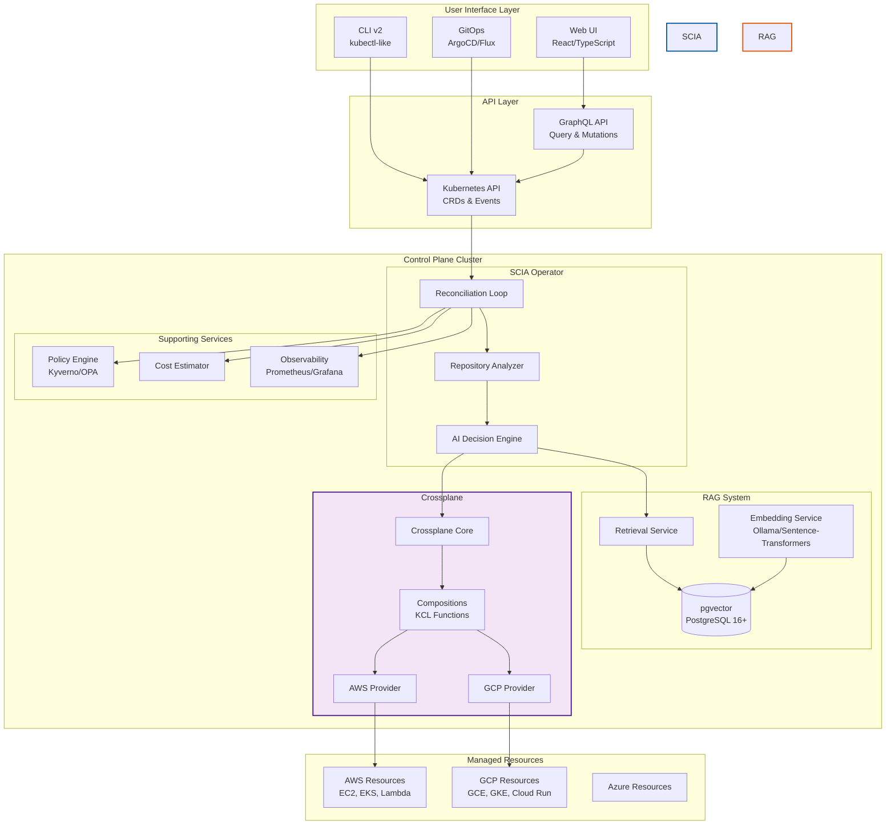

# SCIA v2: Kubernetes-Native AI Infrastructure Control Plane

**Target Architecture for Smart Cloud Infrastructure Automation v2**

## Executive Summary

SCIA v2 transforms the current imperative CLI tool into a **Kubernetes-native control plane** with **RAG-powered decision-making**, enabling continuous reconciliation, drift detection, and collaborative multi-tenant deployments. The architecture leverages Crossplane for cloud resource management, pgvector for contextual RAG capabilities, and custom Kubernetes operators for AI-driven infrastructure automation.

---

## Table of Contents

1. [Current State (v1) vs Target State (v2)](#current-state-v1-vs-target-state-v2)
2. [Core Architecture Principles](#core-architecture-principles)
3. [System Components](#system-components)
4. [RAG Architecture](#rag-architecture)
5. [Kubernetes Control Plane Design](#kubernetes-control-plane-design)
6. [Crossplane Integration](#crossplane-integration)
7. [API Design: GraphQL vs REST](#api-design-graphql-vs-rest)
8. [Multi-Tenancy & Security](#multi-tenancy--security)
9. [Implementation Roadmap](#implementation-roadmap)
10. [Technology Stack](#technology-stack)
11. [Migration Strategy](#migration-strategy)

---

## Current State (v1) vs Target State (v2)

### Current Limitations (v1)

| **Aspect** | **v1 Behavior** | **Problem** |
|------------|----------------|-------------|
| **Execution Model** | Imperative CLI with one-time Terraform apply | No drift detection, no reconciliation |
| **State Management** | Static SQLite database + S3 Terraform state | Cannot observe resource status over time |
| **Knowledge** | Static 3000-line knowledge base | No learning from past deployments |
| **Collaboration** | Single-user, local execution | No multi-tenant support, no shared history |
| **Resource Lifecycle** | Create-only, manual destroy | No automatic healing or updates |
| **Context Awareness** | Analyzes one repo at a time | No awareness of existing infrastructure |

### Target Capabilities (v2)

| **Aspect** | **v2 Behavior** | **Benefit** |
|------------|----------------|-------------|
| **Execution Model** | Kubernetes operator with continuous reconciliation | Automatic drift detection and healing |
| **State Management** | Kubernetes API as source of truth | Real-time resource observation |
| **Knowledge** | RAG with pgvector, learns from all deployments | Context-aware decisions, improving over time |
| **Collaboration** | Multi-tenant control plane | Teams share knowledge, policies, and history |
| **Resource Lifecycle** | Full CRUD with GitOps support | Declarative, version-controlled infrastructure |
| **Context Awareness** | Cluster-wide resource awareness | Optimizes based on existing infrastructure |

---

## Core Architecture Principles

### 1. **Kubernetes API as Universal Interface**

```
┌─────────────────────────────────────────────────────┐
│              Kubernetes API Server                  │
│  (Custom Resources: Deployment, CloudProvider, etc) │
└────────────────┬────────────────────────────────────┘
                 │
     ┌───────────┼───────────┬───────────────┐
     │           │           │               │
┌────▼────┐ ┌───▼────┐ ┌────▼─────┐  ┌─────▼──────┐
│  SCIA   │ │Crosspl.│ │   RAG    │  │ Policy     │
│Operator │ │Operator│ │ Operator │  │ Enforcement│
└─────────┘ └────────┘ └──────────┘  └────────────┘
```

**Why Kubernetes API?**
- **Declarative**: Desired state in YAML/JSON, controllers reconcile
- **Event-Driven**: Watch API for changes, react automatically
- **Extensible**: Custom Resource Definitions (CRDs) for domain-specific resources
- **Built-in**: Authentication, RBAC, audit logging, webhooks
- **Battle-Tested**: Production-ready control loop pattern

### 2. **Separation of Concerns**

```
User Intent Layer      →  `Deployment` CRD (high-level)
  ↓
AI Decision Layer      →  SCIA Operator (strategy, params)
  ↓
Cloud Abstraction      →  Crossplane Compositions (cloud-agnostic)
  ↓
Cloud Provider Layer   →  AWS/GCP/Azure Providers (actual resources)
```

### 3. **RAG-Powered Continuous Learning**

```
New Deployment Request
  ↓
Query Vector DB (pgvector) for similar past deployments
  ↓
Retrieve: successful patterns, failures, cost data, performance metrics
  ↓
LLM generates deployment with learned context
  ↓
Store: deployment metadata, outcome, user feedback
  ↓
Improve future decisions (closed feedback loop)
```

---

## System Components



### Component Descriptions

#### **1. SCIA Operator** (Go, Kubebuilder)

**Custom Resource Definitions:**

```yaml
apiVersion: scia.io/v1alpha1
kind: Deployment
metadata:
  name: flask-app-prod
  namespace: team-backend
spec:
  repository:
    url: https://github.com/acme/flask-app
    ref: main
  prompt: "Deploy this Flask app with high availability and auto-scaling"
  cloudProvider: aws
  region: eu-west-3
  budget:
    maxMonthlyCost: 500  # USD
  policies:
    - require-https
    - enable-monitoring
  strategy: auto  # or: vm, kubernetes, serverless
status:
  phase: Running  # Pending, Analyzing, Provisioning, Running, Failed
  observedGeneration: 5
  conditions:
    - type: Ready
      status: "True"
      reason: DeploymentSuccessful
  infrastructureRef:
    apiVersion: scia.io/v1alpha1
    kind: Infrastructure
    name: flask-app-prod-infra
  endpoints:
    - name: application
      url: https://flask-app.example.com
  cost:
    estimatedMonthly: 287.50
    actualThisMonth: 142.35
  deployment:
    strategy: kubernetes
    reason: "High traffic (10k req/s), needs auto-scaling and zero-downtime deploys"
    confidence: 0.92
    alternativeStrategies:
      - strategy: vm
        reason: "Lower complexity, but manual scaling"
        confidence: 0.65
```

**Reconciliation Loop:**

```go
func (r *DeploymentReconciler) Reconcile(ctx context.Context, req ctrl.Request) (ctrl.Result, error) {
    deployment := &sciaapi.Deployment{}
    if err := r.Get(ctx, req.NamespacedName, deployment); err != nil {
        return ctrl.Result{}, client.IgnoreNotFound(err)
    }

    // 1. Analyze repository (clone, detect framework)
    analysis, err := r.Analyzer.Analyze(ctx, deployment.Spec.Repository)
    if err != nil {
        return r.setError(ctx, deployment, "AnalysisFailed", err)
    }

    // 2. RAG retrieval: similar deployments
    ragContext, err := r.RAG.RetrieveSimilarDeployments(ctx, analysis, deployment.Spec)
    if err != nil {
        log.Error(err, "RAG retrieval failed, using base knowledge")
    }

    // 3. LLM decision with RAG context
    decision, err := r.DecisionEngine.Decide(ctx, DecisionInput{
        Analysis:    analysis,
        UserPrompt:  deployment.Spec.Prompt,
        RAGContext:  ragContext,
        Constraints: deployment.Spec.Budget,
    })
    if err != nil {
        return r.setError(ctx, deployment, "DecisionFailed", err)
    }

    // 4. Create/update Crossplane Composition
    infra := r.buildInfrastructure(deployment, decision)
    if err := r.Client.CreateOrUpdate(ctx, infra); err != nil {
        return ctrl.Result{}, err
    }

    // 5. Update status
    deployment.Status.Strategy = decision.Strategy
    deployment.Status.Confidence = decision.Confidence
    deployment.Status.InfrastructureRef = infra.ObjectRef()
    if err := r.Status().Update(ctx, deployment); err != nil {
        return ctrl.Result{}, err
    }

    // 6. Store deployment for future RAG
    if deployment.Status.Phase == sciaapi.PhaseRunning {
        r.RAG.StoreDeployment(ctx, deployment, decision)
    }

    return ctrl.Result{RequeueAfter: 5 * time.Minute}, nil
}
```

#### **2. RAG System** (Python, FastAPI)

**Architecture:**

```
┌─────────────────────────────────────────────────────┐
│              Embedding Service                      │
│  (sentence-transformers/all-MiniLM-L6-v2)          │
│  Input: Deployment metadata (framework, prompt,    │
│         dependencies, performance metrics)          │
│  Output: 384-dimensional vector                     │
└────────────────┬────────────────────────────────────┘
                 │
                 ▼
┌─────────────────────────────────────────────────────┐
│              PostgreSQL + pgvector                  │
│                                                     │
│  Table: deployment_embeddings                       │
│  ├─ id (uuid)                                       │
│  ├─ deployment_name (text)                          │
│  ├─ namespace (text)                                │
│  ├─ framework (text)                                │
│  ├─ strategy (text)                                 │
│  ├─ embedding (vector(384))                         │
│  ├─ metadata (jsonb) -- analysis, decision, cost    │
│  ├─ outcome (text) -- success, failed, degraded     │
│  ├─ cost_monthly (numeric)                          │
│  ├─ performance_metrics (jsonb)                     │
│  ├─ user_feedback (int) -- thumbs up/down           │
│  └─ created_at (timestamp)                          │
│                                                     │
│  Index: CREATE INDEX ON deployment_embeddings       │
│         USING ivfflat (embedding vector_cosine_ops) │
│         WITH (lists = 100);                         │
└─────────────────────────────────────────────────────┘
```

**Retrieval Flow:**

```python
from sentence_transformers import SentenceTransformer
import psycopg2
from pgvector.psycopg2 import register_vector

class RAGService:
    def __init__(self, db_conn: str, model_name: str = "all-MiniLM-L6-v2"):
        self.model = SentenceTransformer(model_name)
        self.conn = psycopg2.connect(db_conn)
        register_vector(self.conn)

    async def retrieve_similar_deployments(
        self,
        analysis: Analysis,
        user_prompt: str,
        top_k: int = 5
    ) -> List[DeploymentContext]:
        # 1. Create query text
        query_text = f"""
        Framework: {analysis.framework}
        Language: {analysis.language}
        Dependencies: {', '.join(analysis.dependencies[:10])}
        Ports: {', '.join(map(str, analysis.ports))}
        Docker: {analysis.has_docker}
        User intent: {user_prompt}
        """

        # 2. Generate embedding
        query_embedding = self.model.encode(query_text)

        # 3. Vector similarity search
        cursor = self.conn.cursor()
        cursor.execute(
            """
            SELECT
                deployment_name,
                namespace,
                strategy,
                metadata,
                outcome,
                cost_monthly,
                performance_metrics,
                user_feedback,
                1 - (embedding <=> %s) AS similarity
            FROM deployment_embeddings
            WHERE outcome = 'success'
              AND user_feedback >= 0  -- exclude downvoted
            ORDER BY embedding <=> %s
            LIMIT %s
            """,
            (query_embedding, query_embedding, top_k)
        )

        results = cursor.fetchall()
        return [self._parse_result(row) for row in results]

    async def store_deployment(
        self,
        deployment: Deployment,
        decision: Decision,
        outcome: str
    ):
        # Create embedding from deployment metadata
        text = self._deployment_to_text(deployment, decision)
        embedding = self.model.encode(text)

        # Store in database
        cursor = self.conn.cursor()
        cursor.execute(
            """
            INSERT INTO deployment_embeddings (
                id, deployment_name, namespace, framework, strategy,
                embedding, metadata, outcome, cost_monthly, created_at
            ) VALUES (%s, %s, %s, %s, %s, %s, %s, %s, %s, NOW())
            """,
            (
                deployment.uid,
                deployment.name,
                deployment.namespace,
                decision.analysis.framework,
                decision.strategy,
                embedding,
                json.dumps(self._build_metadata(deployment, decision)),
                outcome,
                deployment.status.cost.estimated_monthly
            )
        )
        self.conn.commit()

    def _deployment_to_text(self, deployment: Deployment, decision: Decision) -> str:
        """Convert deployment to searchable text"""
        return f"""
        Framework: {decision.analysis.framework}
        Language: {decision.analysis.language}
        Dependencies: {', '.join(decision.analysis.dependencies)}
        Strategy: {decision.strategy}
        Reason: {decision.reason}
        Region: {deployment.spec.region}
        Instance Type: {decision.config.get('ec2_instance_type', 'N/A')}
        Cluster Nodes: {decision.config.get('eks_desired_nodes', 'N/A')}
        User Prompt: {deployment.spec.prompt}
        """
```

**RAG Knowledge Augmentation:**

The LLM prompt is augmented with retrieved context:

```python
def build_llm_prompt(analysis: Analysis, user_prompt: str, rag_context: List[DeploymentContext]) -> str:
    prompt = f"""
You are an expert cloud infrastructure architect.

## Repository Analysis
Framework: {analysis.framework}
Language: {analysis.language}
Dependencies: {analysis.dependencies}
Ports: {analysis.ports}
Docker: {analysis.has_docker}

## User Intent
{user_prompt}

## Similar Past Deployments (Learned Context)
"""
    for ctx in rag_context:
        prompt += f"""
### Deployment: {ctx.name} (similarity: {ctx.similarity:.2%})
- Strategy: {ctx.strategy}
- Outcome: {ctx.outcome}
- Cost: ${ctx.cost_monthly}/month
- Performance: {ctx.performance_metrics}
- User Feedback: {"👍" if ctx.user_feedback > 0 else "👎"}
- Configuration: {ctx.metadata}

"""

    prompt += """
## Task
Based on the analysis, user intent, and learned context from similar deployments,
recommend the optimal deployment strategy. Output JSON:
{
  "strategy": "vm|kubernetes|serverless",
  "reason": "detailed explanation",
  "confidence": 0.0-1.0,
  "config": {
    "ec2_instance_type": "t3.medium",
    "volume_size": 50,
    ...
  }
}
"""
    return prompt
```

#### **3. Crossplane Integration**

**Custom Compositions with KCL:**

```python
# compositions/scia-vm-deployment.kcl
import crossplane.v1 as cp
import aws.ec2.v1beta1 as ec2

schema VMDeploymentSpec:
    framework: str
    instanceType: str = "t3.medium"
    volumeSize: int = 30
    region: str = "eu-west-3"
    appPort: int
    startCommand: str

# Composition function: generate AWS resources
composition VMDeployment:
    spec: VMDeploymentSpec

    # Security Group
    resources: [
        cp.ComposedResource {
            name: "security-group"
            base: ec2.SecurityGroup {
                metadata.name: spec.framework + "-sg"
                spec: {
                    forProvider: {
                        region: spec.region
                        description: "SCIA-managed security group for " + spec.framework
                        ingress: [
                            {
                                fromPort: spec.appPort
                                toPort: spec.appPort
                                protocol: "tcp"
                                cidrBlocks: ["0.0.0.0/0"]
                            },
                            {
                                fromPort: 22
                                toPort: 22
                                protocol: "tcp"
                                cidrBlocks: ["0.0.0.0/0"]
                            }
                        ]
                    }
                }
            }
        },

        # Launch Template
        cp.ComposedResource {
            name: "launch-template"
            base: ec2.LaunchTemplate {
                # ... template spec
            }
        },

        # Auto Scaling Group
        cp.ComposedResource {
            name: "asg"
            base: ec2.AutoScalingGroup {
                # ... ASG spec with reference to launch template
            }
        }
    ]
```

**SCIA Operator creates Crossplane Composite Resource:**

```go
func (r *DeploymentReconciler) buildInfrastructure(
    deployment *sciaapi.Deployment,
    decision Decision
) *unstructured.Unstructured {
    infra := &unstructured.Unstructured{}
    infra.SetGroupVersionKind(schema.GroupVersionKind{
        Group:   "scia.io",
        Version: "v1alpha1",
        Kind:    "Infrastructure",
    })
    infra.SetName(deployment.Name + "-infra")
    infra.SetNamespace(deployment.Namespace)

    // Map SCIA decision to Crossplane Composition claim
    compositionRef := fmt.Sprintf("scia-%s-deployment", decision.Strategy)

    spec := map[string]interface{}{
        "compositionRef": map[string]interface{}{
            "name": compositionRef,
        },
        "parameters": map[string]interface{}{
            "framework":     decision.Analysis.Framework,
            "instanceType":  decision.Config["ec2_instance_type"],
            "volumeSize":    decision.Config["volume_size"],
            "region":        deployment.Spec.Region,
            "appPort":       decision.Analysis.Port,
            "startCommand":  decision.Analysis.StartCommand,
            "repositoryUrl": deployment.Spec.Repository.URL,
        },
    }

    infra.Object["spec"] = spec
    return infra
}
```

#### **4. Multi-Cloud Provider Abstraction**

```yaml
apiVersion: scia.io/v1alpha1
kind: CloudProvider
metadata:
  name: aws-production
  namespace: team-backend
spec:
  type: aws
  credentials:
    source: Secret
    secretRef:
      name: aws-credentials
      namespace: team-backend
  defaultRegion: eu-west-3
  quotas:
    maxEC2Instances: 50
    maxEKSClusters: 3
  costControl:
    monthlyBudget: 5000
    alertThreshold: 0.8
  tags:
    managed-by: scia
    team: backend
    environment: production
```

---

## RAG Architecture

### Why RAG for Infrastructure?

Traditional static knowledge bases (like SCIA v1's 3000-line knowledge.go) cannot:
- **Learn from failures**: Same mistakes repeated
- **Adapt to cost changes**: AWS pricing updates quarterly
- **Leverage team knowledge**: Successful patterns not shared
- **Consider context**: Ignore existing infrastructure

**RAG solves this by:**
1. **Storing** every deployment with outcome metadata
2. **Retrieving** similar past deployments during decision-making
3. **Learning** from successes (high user feedback, low cost, good performance)
4. **Avoiding** known failures (similar deployments that failed)

### RAG vs Fine-Tuning

| Approach | Pros | Cons | Verdict |
|----------|------|------|---------|
| **Fine-Tuning** | Better accuracy, faster inference | Expensive, slow updates, model drift | ❌ Not suitable |
| **RAG** | Dynamic updates, explainable, cost-effective | Slightly slower, needs vector DB | ✅ **Recommended** |

**Why RAG wins:**
- New deployment patterns added instantly (no retraining)
- Explainable: "Recommended Kubernetes because deployment X succeeded with same stack"
- Cost: PostgreSQL + pgvector cheaper than fine-tuning GPT-4
- Privacy: All data stays in-cluster

### Embedding Strategy

**What to embed?**
- Repository metadata: framework, language, dependencies
- User intent: natural language prompt
- Historical outcomes: success/failure, cost, performance
- Infrastructure config: instance types, regions, services

**Embedding model:** `sentence-transformers/all-MiniLM-L6-v2`
- **Size:** 384 dimensions (compact)
- **Speed:** 14,000 sentences/sec on CPU
- **Quality:** 60% of performance vs large models, 10x faster

**Alternatives:**
- `text-embedding-ada-002` (OpenAI): Better quality, requires API calls
- `e5-large-v2`: Better accuracy, 1024 dimensions (2.7x larger)

### Vector Database: pgvector vs Dedicated Solutions

| Database | Pros | Cons | Verdict |
|----------|------|------|---------|
| **pgvector** | Unified DB (relational + vector), mature PostgreSQL ecosystem, free | Slower than specialized DBs | ✅ **Best for SCIA v2** |
| **Weaviate** | Fast hybrid search, built-in LLM integration | Extra service to manage | ⚠️ Consider for scale |
| **Pinecone** | Fully managed, auto-scaling | Vendor lock-in, $$$ | ❌ Avoid |
| **Qdrant** | Fast, Rust-based, good filtering | Another service | ⚠️ Consider for scale |

**Recommendation:** Start with pgvector
- Most SCIA deployments < 100k vectors (pgvector sweet spot)
- Already need PostgreSQL for metadata
- Simplifies operations (one database)
- Easy migration to Weaviate/Qdrant later if needed

### Retrieval Strategy

**Hybrid Search:**
```sql
-- Combine vector similarity + metadata filtering
SELECT
    deployment_name,
    strategy,
    metadata,
    1 - (embedding <=> $query_embedding) AS similarity
FROM deployment_embeddings
WHERE
    framework = $framework  -- Exact match on framework
    AND outcome = 'success'  -- Only successful deployments
    AND cost_monthly <= $budget  -- Within budget
    AND user_feedback >= 0  -- Positive/neutral feedback
ORDER BY embedding <=> $query_embedding
LIMIT 5;
```

**Re-ranking:**
After vector retrieval, re-rank by:
1. User feedback score (thumbs up/down)
2. Recency (newer deployments weighted higher)
3. Cost efficiency (lower cost preferred)

```python
def rerank_results(results: List[DeploymentContext], weights: Dict[str, float]) -> List[DeploymentContext]:
    """
    weights = {
        'similarity': 0.5,
        'user_feedback': 0.2,
        'recency': 0.2,
        'cost_efficiency': 0.1
    }
    """
    for result in results:
        score = (
            weights['similarity'] * result.similarity +
            weights['user_feedback'] * normalize_feedback(result.user_feedback) +
            weights['recency'] * recency_score(result.created_at) +
            weights['cost_efficiency'] * cost_score(result.cost_monthly)
        )
        result.rerank_score = score

    return sorted(results, key=lambda x: x.rerank_score, reverse=True)
```

---

## Kubernetes Control Plane Design

### Cluster Architecture

```
┌─────────────────────────────────────────────────────┐
│         Management Cluster (SCIA Control Plane)     │
│  ┌──────────────────────────────────────────────┐   │
│  │  Namespace: scia-system                      │   │
│  │  - SCIA Operator                             │   │
│  │  - RAG Service (Embedding + Retrieval)       │   │
│  │  - PostgreSQL + pgvector                     │   │
│  │  - Crossplane Core                           │   │
│  │  - GraphQL API Server                        │   │
│  │  - Web UI                                    │   │
│  └──────────────────────────────────────────────┘   │
│                                                      │
│  ┌──────────────────────────────────────────────┐   │
│  │  Namespace: team-backend (tenant)            │   │
│  │  - Deployment CRs                            │   │
│  │  - CloudProvider CRs                         │   │
│  └──────────────────────────────────────────────┘   │
│                                                      │
│  ┌──────────────────────────────────────────────┐   │
│  │  Namespace: team-frontend (tenant)           │   │
│  │  - Deployment CRs                            │   │
│  └──────────────────────────────────────────────┘   │
└─────────────────────────────────────────────────────┘
          │                           │
          │ Crossplane Providers      │
          │ (AWS, GCP, Azure)         │
          ▼                           ▼
    ┌──────────┐              ┌──────────┐
    │   AWS    │              │   GCP    │
    │ Account  │              │ Project  │
    └──────────┘              └──────────┘
```

### Multi-Tenancy Model: **Namespace-Based Soft Isolation**

**Rationale:**
- Most use cases: Small-to-medium teams (5-50 users)
- Cost-effective: One cluster vs multiple clusters
- Sufficient isolation: RBAC + NetworkPolicies + ResourceQuotas
- Easier ops: Single control plane to manage

**Tenant Onboarding:**

```yaml
apiVersion: v1
kind: Namespace
metadata:
  name: team-backend
  labels:
    scia.io/tenant: "true"
    team: backend
---
apiVersion: v1
kind: ResourceQuota
metadata:
  name: team-backend-quota
  namespace: team-backend
spec:
  hard:
    requests.cpu: "100"
    requests.memory: 200Gi
    persistentvolumeclaims: "10"
    count/deployments.scia.io: "50"  # Max 50 SCIA deployments
---
apiVersion: rbac.authorization.k8s.io/v1
kind: RoleBinding
metadata:
  name: team-backend-admins
  namespace: team-backend
subjects:
  - kind: Group
    name: team-backend
    apiGroup: rbac.authorization.k8s.io
roleRef:
  kind: ClusterRole
  name: scia-deployer  # Custom role for SCIA resources
  apiGroup: rbac.authorization.k8s.io
```

### Controller Pattern

```go
// SCIA Operator uses Kubebuilder
package main

import (
    "sigs.k8s.io/controller-runtime/pkg/builder"
    "sigs.k8s.io/controller-runtime/pkg/client"
    "sigs.k8s.io/controller-runtime/pkg/manager"
)

func main() {
    mgr, err := ctrl.NewManager(ctrl.GetConfigOrDie(), ctrl.Options{
        Scheme: scheme,
        Metrics: server.Options{BindAddress: ":8080"},
    })
    if err != nil {
        panic(err)
    }

    // Register Deployment controller
    if err := (&DeploymentReconciler{
        Client:         mgr.GetClient(),
        Analyzer:       analyzer.New(),
        RAG:            rag.NewService(ragConfig),
        DecisionEngine: llm.NewEngine(llmConfig),
        Crossplane:     crossplane.NewClient(mgr.GetClient()),
    }).SetupWithManager(mgr); err != nil {
        panic(err)
    }

    // Start manager (runs controllers)
    if err := mgr.Start(ctrl.SetupSignalHandler()); err != nil {
        panic(err)
    }
}
```

---

## Crossplane Integration

### Composition Function Pattern

SCIA uses **KCL-based Composition Functions** for:
1. **Dynamic logic**: Calculate instance types, node counts based on analysis
2. **Policy enforcement**: Auto-enable monitoring, HTTPS, backups
3. **Best practices**: Security groups, IAM roles, tagging

**Example: Auto-scaling EC2 based on predicted load**

```python
# compositions/autoscaling-vm.kcl
import crossplane.v1 as cp
import aws.ec2.v1beta1 as ec2

schema AutoScalingVMSpec:
    framework: str
    expectedRPS: int  # Requests per second
    region: str

# Calculate instance type based on load
def calculate_instance_type(rps: int) -> str:
    if rps < 100:
        "t3.small"
    elif rps < 1000:
        "t3.medium"
    elif rps < 5000:
        "t3.large"
    else:
        "t3.xlarge"

# Calculate ASG size
def calculate_asg_size(rps: int) -> {str: int}:
    instances = max(2, rps // 500)  # 500 RPS per instance
    {
        "min": max(2, instances // 2),
        "max": instances * 2,
        "desired": instances
    }

composition AutoScalingVM:
    spec: AutoScalingVMSpec

    instance_type = calculate_instance_type(spec.expectedRPS)
    asg_size = calculate_asg_size(spec.expectedRPS)

    resources: [
        cp.ComposedResource {
            name: "asg"
            base: ec2.AutoScalingGroup {
                spec.forProvider: {
                    region: spec.region
                    minSize: asg_size.min
                    maxSize: asg_size.max
                    desiredCapacity: asg_size.desired
                    launchTemplate: {
                        # Reference to launch template
                    }
                    tags: [
                        {key: "managed-by", value: "scia"},
                        {key: "framework", value: spec.framework},
                        {key: "predicted-rps", value: str(spec.expectedRPS)}
                    ]
                }
            }
        }
    ]
```

### Why Crossplane > Direct Terraform?

| Aspect | Terraform (v1) | Crossplane (v2) | Winner |
|--------|----------------|-----------------|--------|
| **Reconciliation** | Manual `terraform apply` | Continuous drift detection | ✅ Crossplane |
| **State Management** | S3 backend, locking issues | Kubernetes API (etcd) | ✅ Crossplane |
| **Multi-Cloud** | Multiple providers, duplication | Unified compositions | ✅ Crossplane |
| **GitOps** | External tools (Atlantis) | Native (ArgoCD/Flux) | ✅ Crossplane |
| **RBAC** | Separate system | Kubernetes RBAC | ✅ Crossplane |
| **Observability** | Logs, state files | Kubernetes events, metrics | ✅ Crossplane |
| **Learning Curve** | Low | High | ⚠️ Terraform |

**Verdict:** Crossplane wins for v2 (control plane benefits > learning curve)

---

## API Design: GraphQL vs REST

### Recommendation: **GraphQL for primary API, Kubernetes API for internal**

#### Why GraphQL?

**1. Frontend Flexibility**

```graphql
# Frontend can request exactly what it needs
query GetDeployment($id: ID!) {
  deployment(id: $id) {
    name
    status {
      phase
      endpoints {
        url
      }
      cost {
        estimatedMonthly
      }
    }
    # No need to fetch entire Infrastructure object
  }
}
```

vs REST:
```
GET /api/v1/deployments/:id
  → Returns full object, frontend filters

GET /api/v1/deployments/:id/status
GET /api/v1/deployments/:id/cost
  → Multiple requests for related data
```

**2. Real-Time Updates**

```graphql
subscription DeploymentUpdated($id: ID!) {
  deploymentUpdated(id: $id) {
    status {
      phase
      conditions {
        type
        status
        message
      }
    }
  }
}
```

**3. Strong Typing**

```graphql
type Deployment {
  id: ID!
  name: String!
  namespace: String!
  spec: DeploymentSpec!
  status: DeploymentStatus!
  createdAt: DateTime!
}

type DeploymentSpec {
  repository: Repository!
  prompt: String!
  cloudProvider: CloudProvider!
  region: String!
  budget: Budget
  strategy: DeploymentStrategy
}

enum DeploymentStrategy {
  AUTO
  VM
  KUBERNETES
  SERVERLESS
}
```

**4. Mutations for Complex Operations**

```graphql
mutation CreateDeployment($input: CreateDeploymentInput!) {
  createDeployment(input: $input) {
    deployment {
      id
      name
      status {
        phase
      }
    }
    errors {
      field
      message
    }
  }
}

mutation ProvideDeploymentFeedback($id: ID!, $feedback: Int!) {
  provideDeploymentFeedback(deploymentId: $id, feedback: $feedback) {
    success
  }
}
```

#### GraphQL Architecture

```
┌─────────────┐
│   Web UI    │
│  (React)    │
└──────┬──────┘
       │ GraphQL queries/mutations/subscriptions
       │
┌──────▼────────────────────────────────┐
│   GraphQL API Server                  │
│   (gqlgen - Go GraphQL framework)     │
│                                       │
│   Resolvers:                          │
│   - Query.deployment                  │
│   - Query.deployments                 │
│   - Mutation.createDeployment         │
│   - Mutation.deleteDeployment         │
│   - Subscription.deploymentUpdated    │
└──────┬────────────────────────────────┘
       │
       │ Read/Write Kubernetes CRs
       │
┌──────▼────────────────────────────────┐
│   Kubernetes API Server               │
│   (Deployment, Infrastructure CRDs)   │
└───────────────────────────────────────┘
```

**Example Resolver:**

```go
package graph

import (
    "context"
    metav1 "k8s.io/apimachinery/pkg/apis/meta/v1"
    sciaapi "github.com/smana/scia/api/v1alpha1"
)

type Resolver struct {
    k8sClient client.Client
}

func (r *queryResolver) Deployment(ctx context.Context, id string) (*model.Deployment, error) {
    // Parse ID as namespace/name
    namespace, name := parseID(id)

    // Fetch from Kubernetes API
    deployment := &sciaapi.Deployment{}
    err := r.k8sClient.Get(ctx, client.ObjectKey{
        Namespace: namespace,
        Name:      name,
    }, deployment)
    if err != nil {
        return nil, err
    }

    // Convert to GraphQL model
    return convertToGraphQL(deployment), nil
}

func (r *mutationResolver) CreateDeployment(
    ctx context.Context,
    input model.CreateDeploymentInput,
) (*model.CreateDeploymentPayload, error) {
    // Create Kubernetes CR
    deployment := &sciaapi.Deployment{
        ObjectMeta: metav1.ObjectMeta{
            Name:      input.Name,
            Namespace: input.Namespace,
        },
        Spec: sciaapi.DeploymentSpec{
            Repository: sciaapi.Repository{
                URL: input.Repository.URL,
                Ref: input.Repository.Ref,
            },
            Prompt:        input.Prompt,
            CloudProvider: input.CloudProvider,
            Region:        input.Region,
        },
    }

    if err := r.k8sClient.Create(ctx, deployment); err != nil {
        return &model.CreateDeploymentPayload{
            Errors: []*model.Error{{Message: err.Error()}},
        }, nil
    }

    return &model.CreateDeploymentPayload{
        Deployment: convertToGraphQL(deployment),
    }, nil
}
```

#### Why NOT REST?

**Cons of REST for SCIA:**
- Over-fetching: Mobile clients waste bandwidth
- Under-fetching: Multiple requests for related data (deployment + status + cost)
- Versioning complexity: `/v1`, `/v2` as API evolves
- Real-time: WebSocket separate from HTTP (no unified API)

**When REST makes sense:**
- Simple CRUD APIs
- Caching-heavy workloads (REST caching easier)
- Public APIs with broad compatibility needs

**Verdict:** GraphQL for SCIA v2 web UI, Kubernetes API for CLI/GitOps

---

## Multi-Tenancy & Security

### RBAC Model

```yaml
# ClusterRole: SCIA Deployer (can manage deployments)
apiVersion: rbac.authorization.k8s.io/v1
kind: ClusterRole
metadata:
  name: scia-deployer
rules:
  - apiGroups: ["scia.io"]
    resources: ["deployments", "infrastructures", "cloudproviders"]
    verbs: ["get", "list", "watch", "create", "update", "patch", "delete"]
  - apiGroups: [""]
    resources: ["events"]
    verbs: ["get", "list", "watch"]
---
# ClusterRole: SCIA Viewer (read-only)
apiVersion: rbac.authorization.k8s.io/v1
kind: ClusterRole
metadata:
  name: scia-viewer
rules:
  - apiGroups: ["scia.io"]
    resources: ["deployments", "infrastructures"]
    verbs: ["get", "list", "watch"]
```

### Admission Control

**Validating Webhook:** Enforce policies on Deployment creation

```go
func (v *DeploymentValidator) ValidateCreate(ctx context.Context, obj runtime.Object) error {
    deployment := obj.(*sciaapi.Deployment)

    // 1. Check budget limit
    if deployment.Spec.Budget != nil {
        if deployment.Spec.Budget.MaxMonthlyCost < 10 {
            return errors.New("budget too low: minimum $10/month")
        }
    }

    // 2. Enforce policies
    requiredPolicies := []string{"require-https", "enable-monitoring"}
    for _, required := range requiredPolicies {
        if !contains(deployment.Spec.Policies, required) {
            return fmt.Errorf("missing required policy: %s", required)
        }
    }

    // 3. Validate cloud provider exists
    provider := &sciaapi.CloudProvider{}
    err := v.Client.Get(ctx, client.ObjectKey{
        Namespace: deployment.Namespace,
        Name:      deployment.Spec.CloudProvider,
    }, provider)
    if err != nil {
        return fmt.Errorf("cloud provider %s not found", deployment.Spec.CloudProvider)
    }

    return nil
}
```

### Network Policies

```yaml
# Isolate RAG service (only SCIA operator can access)
apiVersion: networking.k8s.io/v1
kind: NetworkPolicy
metadata:
  name: rag-service-isolation
  namespace: scia-system
spec:
  podSelector:
    matchLabels:
      app: rag-service
  policyTypes:
    - Ingress
  ingress:
    - from:
        - podSelector:
            matchLabels:
              app: scia-operator
      ports:
        - protocol: TCP
          port: 8080
```

### Secrets Management

**CloudProvider credentials:**

```yaml
apiVersion: v1
kind: Secret
metadata:
  name: aws-credentials
  namespace: team-backend
type: Opaque
stringData:
  credentials: |
    [default]
    aws_access_key_id = AKIA...
    aws_secret_access_key = ...
---
apiVersion: scia.io/v1alpha1
kind: CloudProvider
metadata:
  name: aws-production
  namespace: team-backend
spec:
  type: aws
  credentials:
    source: Secret
    secretRef:
      name: aws-credentials
      namespace: team-backend
```

**Recommended: External Secrets Operator + Vault**

```yaml
apiVersion: external-secrets.io/v1beta1
kind: ExternalSecret
metadata:
  name: aws-credentials
  namespace: team-backend
spec:
  refreshInterval: 1h
  secretStoreRef:
    name: vault-backend
    kind: SecretStore
  target:
    name: aws-credentials
  data:
    - secretKey: credentials
      remoteRef:
        key: secret/data/team-backend/aws
        property: credentials
```

---

## Implementation Roadmap

### Phase 1: Foundation (3 months)

**Goal:** Basic Kubernetes control plane with CRDs

- [ ] Design CRDs: `Deployment`, `Infrastructure`, `CloudProvider`
- [ ] Implement SCIA Operator skeleton (Kubebuilder)
- [ ] Port existing analyzer logic from v1
- [ ] Basic reconciliation loop (no RAG, use static LLM)
- [ ] Deploy on dev cluster, test with Flask/Express apps
- [ ] **Deliverable:** `kubectl apply -f deployment.yaml` creates EC2 instance

### Phase 2: Crossplane Integration (2 months)

**Goal:** Replace inline Terraform with Crossplane compositions

- [ ] Install Crossplane + AWS Provider
- [ ] Write KCL compositions for VM, Kubernetes, Serverless
- [ ] SCIA Operator creates Crossplane Composite Resources
- [ ] Test multi-cloud (AWS + GCP)
- [ ] **Deliverable:** Crossplane manages all cloud resources

### Phase 3: RAG System (3 months)

**Goal:** Learn from past deployments

- [ ] Deploy PostgreSQL + pgvector
- [ ] Implement embedding service (sentence-transformers)
- [ ] Store deployment metadata with embeddings
- [ ] Retrieval service: similarity search + filtering
- [ ] Integrate RAG context into LLM prompts
- [ ] **Deliverable:** Recommendations improve over time

### Phase 4: GraphQL API & Web UI (2 months)

**Goal:** User-friendly interface

- [ ] Design GraphQL schema
- [ ] Implement resolvers (gqlgen)
- [ ] Real-time subscriptions for deployment status
- [ ] Build React web UI (queries, mutations, subscriptions)
- [ ] **Deliverable:** Web UI for creating/managing deployments

### Phase 5: Multi-Tenancy & Production Hardening (2 months)

**Goal:** Production-ready control plane

- [ ] Namespace-based multi-tenancy
- [ ] RBAC roles: deployer, viewer, admin
- [ ] Admission webhooks: validation, policy enforcement
- [ ] Cost estimation before deployment
- [ ] User feedback mechanism (thumbs up/down)
- [ ] **Deliverable:** Multi-tenant production cluster

### Phase 6: Advanced Features (ongoing)

- [ ] Policy engine (Kyverno/OPA) for compliance
- [ ] Cost optimization recommendations
- [ ] Deployment rollback
- [ ] Private Git repository support (SSH keys)
- [ ] GitOps integration (ArgoCD auto-sync)

---

## Technology Stack

### Core Infrastructure

| Component | Technology | Rationale |
|-----------|-----------|-----------|
| **Control Plane** | Kubernetes 1.31+ | Industry standard, mature ecosystem |
| **Operator Framework** | Kubebuilder 3.0+ | Code generation, best practices |
| **Cloud Abstraction** | Crossplane 1.15+ | Multi-cloud, declarative, KCL support |
| **Language** | Go 1.25 | Operator SDK, performance, K8s ecosystem |
| **Orchestrator** | Dagger | Existing v1 CI/CD, containerized tasks |

### RAG System

| Component | Technology | Rationale |
|-----------|-----------|-----------|
| **Vector Database** | PostgreSQL 16 + pgvector | Unified DB, mature, cost-effective |
| **Embedding Model** | `all-MiniLM-L6-v2` | Fast, compact (384 dim), good quality |
| **Embedding Service** | FastAPI + sentence-transformers | Python ML ecosystem, async |
| **LLM** | Ollama (qwen2.5-coder:7b) | v1 compatibility, local inference |
| **Alternative LLM** | Gemini/OpenAI (optional) | Better accuracy, API-based |

### API & Frontend

| Component | Technology | Rationale |
|-----------|-----------|-----------|
| **GraphQL API** | gqlgen (Go) | Type-safe, code generation, performance |
| **Web UI** | React 18 + TypeScript | Modern, Apollo Client for GraphQL |
| **Subscriptions** | GraphQL over WebSocket | Real-time deployment updates |
| **CLI v2** | Cobra (Go) | v1 compatibility, kubectl-like UX |

### Supporting Services

| Component | Technology | Rationale |
|-----------|-----------|-----------|
| **Policy Engine** | Kyverno | Kubernetes-native, easier than OPA |
| **Secrets** | External Secrets Operator + Vault | Secure, GitOps-friendly |
| **GitOps** | ArgoCD | SCIA deployments as Git-tracked CRs |
| **Monitoring** | Prometheus + Grafana | Kubernetes standard |
| **Logging** | Loki | Label-based, integrates with Grafana |

---

## Migration Strategy

### Coexistence: v1 CLI → v2 Control Plane

**Approach:** v1 and v2 run in parallel during migration

```
┌─────────────────────────────────────────────────────┐
│  SCIA v1 (CLI)                                      │
│  - Continues to work as-is                          │
│  - Stores deployments in SQLite                     │
│  - Applies Terraform directly                       │
└────────────────┬────────────────────────────────────┘
                 │
                 │ Optional: Push metadata to v2
                 │
                 ▼
┌─────────────────────────────────────────────────────┐
│  SCIA v2 (Control Plane)                            │
│  - New deployments go through operator              │
│  - RAG learns from v1 history (batch import)        │
│  - Crossplane manages resources                     │
└─────────────────────────────────────────────────────┘
```

**Migration Steps:**

1. **Import v1 deployments into RAG**
   ```bash
   # Export v1 SQLite to JSON
   scia export --format json > v1_deployments.json

   # Import into v2 RAG system
   kubectl apply -f - <<EOF
   apiVersion: batch/v1
   kind: Job
   metadata:
     name: import-v1-deployments
     namespace: scia-system
   spec:
     template:
       spec:
         containers:
           - name: importer
             image: scia-rag-importer:latest
             env:
               - name: V1_EXPORT_FILE
                 value: /data/v1_deployments.json
         volumes:
           - name: data
             configMap:
               name: v1-export
   EOF
   ```

2. **Gradual adoption**
   - **Week 1-4:** v2 in dev cluster, team testing
   - **Week 5-8:** New projects use v2, existing stay on v1
   - **Week 9-12:** Migrate one v1 deployment per week to v2
   - **Month 4+:** v1 deprecated, readonly mode

3. **Rollback plan**
   - v2 operator exports to Terraform (compatibility layer)
   - Emergency: disable v2 operator, run v1 CLI

---

## Architectural Improvements & Considerations

### 1. **Observability**

**Kubernetes Events:**
```go
r.Recorder.Event(deployment, corev1.EventTypeNormal, "AnalysisComplete",
    fmt.Sprintf("Detected framework: %s", analysis.Framework))
```

**Prometheus Metrics:**
```go
var (
    deploymentsTotal = prometheus.NewCounterVec(
        prometheus.CounterOpts{
            Name: "scia_deployments_total",
            Help: "Total number of deployments",
        },
        []string{"strategy", "framework", "outcome"},
    )

    deploymentDuration = prometheus.NewHistogramVec(
        prometheus.HistogramOpts{
            Name: "scia_deployment_duration_seconds",
            Help: "Deployment duration in seconds",
        },
        []string{"strategy"},
    )
)
```

**Grafana Dashboard:**
- Deployments by strategy (pie chart)
- Success rate over time (line graph)
- Average deployment time (gauge)
- RAG retrieval latency (histogram)
- LLM decision confidence (gauge)

### 2. **Cost Optimization**

**Pre-deployment cost estimation:**
```go
func (r *DeploymentReconciler) estimateCost(decision Decision) (float64, error) {
    // Use AWS Pricing API or static pricing data
    estimator := cost.NewEstimator(decision.CloudProvider, decision.Region)

    switch decision.Strategy {
    case "vm":
        return estimator.EC2Cost(
            decision.Config["ec2_instance_type"],
            decision.Config["volume_size"],
        )
    case "kubernetes":
        return estimator.EKSCost(
            decision.Config["eks_node_type"],
            decision.Config["eks_desired_nodes"],
        )
    }
}
```

**Budget alerts:**
```yaml
apiVersion: scia.io/v1alpha1
kind: Deployment
spec:
  budget:
    maxMonthlyCost: 500
    alertThreshold: 0.8  # Alert at 80%
    enforcementMode: soft  # soft: warn, hard: block
```

### 3. **Feedback Loop**

**Web UI feedback widget:**
```tsx
<DeploymentDetails deployment={deployment}>
  <FeedbackWidget>
    <ThumbsUp onClick={() => provideFeedback(deployment.id, 1)} />
    <ThumbsDown onClick={() => provideFeedback(deployment.id, -1)} />
  </FeedbackWidget>
</DeploymentDetails>
```

**GraphQL mutation:**
```graphql
mutation ProvideFeedback($id: ID!, $feedback: Int!, $comment: String) {
  provideDeploymentFeedback(
    deploymentId: $id
    feedback: $feedback
    comment: $comment
  ) {
    success
    message
  }
}
```

**RAG re-ranking uses feedback:**
```sql
-- Higher user_feedback = higher ranking
SELECT *
FROM deployment_embeddings
WHERE user_feedback >= 0  -- Exclude downvoted
ORDER BY
  (embedding <=> $query_embedding) * (1 + user_feedback * 0.1)  -- Boost by 10% per upvote
LIMIT 5;
```

### 4. **Rollback & Versioning**

**Deployment history:**
```yaml
apiVersion: scia.io/v1alpha1
kind: Deployment
status:
  history:
    - revision: 1
      timestamp: "2025-10-18T10:00:00Z"
      infrastructureRef: flask-app-prod-infra-v1
      outcome: success
    - revision: 2
      timestamp: "2025-10-19T14:30:00Z"
      infrastructureRef: flask-app-prod-infra-v2
      outcome: failed
      reason: "Health check timeout"
```

**Rollback command:**
```bash
kubectl scia rollback deployment/flask-app-prod --to-revision 1
```

**Implementation:**
- SCIA Operator creates new Infrastructure CR with previous config
- Crossplane reconciles (destroys v2 resources, recreates v1)
- Blue-green: Keep both versions, switch traffic

---

## Summary: Why This Architecture?

### ✅ Solves v1 Problems

| v1 Problem | v2 Solution |
|------------|-------------|
| **No drift detection** | Kubernetes reconciliation loop |
| **Static parameters** | RAG learns from deployments |
| **No collaboration** | Multi-tenant control plane |
| **Manual lifecycle** | Declarative CRDs, GitOps |
| **No context awareness** | RAG retrieves similar deployments |

### ✅ Leverages Kubernetes Strengths

- **Declarative**: Desired state in Git, controllers reconcile
- **Self-healing**: Failed deployments auto-retry
- **Extensible**: Add new strategies without core changes
- **Observable**: Built-in events, metrics, logs
- **Secure**: RBAC, NetworkPolicies, admission control

### ✅ RAG Provides Continuous Learning

- **Day 1:** Static knowledge base (like v1)
- **Day 30:** 100 deployments stored, retrieval starts helping
- **Day 90:** 500 deployments, RAG recommends based on team patterns
- **Day 180:** 1000+ deployments, decisions highly accurate, cost-optimized

### ✅ Crossplane Simplifies Multi-Cloud

- **Single API:** Same CRD for AWS, GCP, Azure
- **Compositions:** Reusable, policy-enforced templates
- **GitOps-native:** ArgoCD syncs compositions from Git
- **No state locking:** Kubernetes API handles concurrency

---

## Next Steps

1. **Validate with stakeholders:** Review this architecture with team
2. **Proof of concept:** Implement Phase 1 (basic operator) in 1 month
3. **Measure success:**
   - Time to deploy: < 5 minutes (same as v1)
   - RAG improvement: 20% better decisions after 100 deployments
   - Multi-tenancy: 5 teams using shared control plane
4. **Iterate:** Gather feedback, adjust roadmap

---

## References

- [Kubernetes Operator Pattern](https://kubernetes.io/docs/concepts/extend-kubernetes/operator/)
- [Crossplane Composition Functions](https://docs.crossplane.io/latest/concepts/composition-functions/)
- [pgvector Documentation](https://github.com/pgvector/pgvector)
- [RAG Architecture Best Practices](https://cloud.google.com/architecture/rag-capable-gen-ai-app-using-gke)
- [Multi-Tenancy in Kubernetes](https://kubernetes.io/docs/concepts/security/multi-tenancy/)
- [Kubebuilder Book](https://book.kubebuilder.io/)
- [GraphQL vs REST](https://www.apollographql.com/blog/graphql/basics/graphql-vs-rest/)

---

**Version:** 1.0
**Author:** AI-Assisted Architecture Design
**Date:** 2025-10-18
**Status:** Proposal for Review
