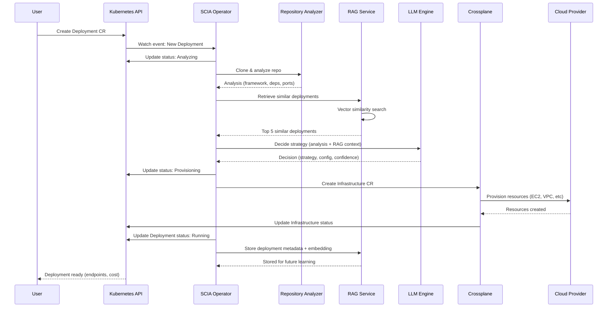

# SCIA v2 Architecture Diagrams

## High-Level System Overview

```mermaid
graph TB
    subgraph "User Interaction Layer"
        WebUI["🌐 Web UI<br/>(React + TypeScript)"]
        CLI["💻 CLI v2<br/>(kubectl-like)"]
        GitOps["📦 GitOps<br/>(ArgoCD/Flux)"]
    end

    subgraph "API Gateway"
        GraphQLAPI["🔌 GraphQL API<br/>(Queries, Mutations, Subscriptions)"]
        K8sAPI["☸️ Kubernetes API<br/>(Custom Resources)"]
    end

    subgraph "SCIA Control Plane Cluster"
        subgraph "Operators & Controllers"
            SCIAOp["🤖 SCIA Operator<br/>(Reconciliation Loop)"]
            XPlane["⚡ Crossplane<br/>(Cloud Resources)"]
        end

        subgraph "AI & Decision Engine"
            Analyzer["🔍 Repository Analyzer<br/>(Framework Detection)"]
            LLM["🧠 LLM Engine<br/>(Ollama/Gemini/OpenAI)"]
            RAGRetriever["📚 RAG Retriever<br/>(Similarity Search)"]
        end

        subgraph "Data Layer"
            PgVector[("🗄️ PostgreSQL + pgvector<br/>(Vector Embeddings)")]
            Embedder["🔢 Embedding Service<br/>(sentence-transformers)"]
        end

        subgraph "Supporting Services"
            Policy["🛡️ Policy Engine<br/>(Kyverno/OPA)"]
            Cost["💰 Cost Estimator"]
            Observability["📊 Observability<br/>(Prometheus/Grafana)"]
        end
    end

    subgraph "Cloud Providers"
        AWS["☁️ AWS<br/>(EC2, EKS, Lambda)"]
        GCP["☁️ GCP<br/>(GCE, GKE, Cloud Run)"]
        Azure["☁️ Azure"]
    end

    WebUI --> GraphQLAPI
    CLI --> K8sAPI
    GitOps --> K8sAPI
    GraphQLAPI --> K8sAPI

    K8sAPI --> SCIAOp
    SCIAOp --> Analyzer
    Analyzer --> LLM
    LLM --> RAGRetriever
    RAGRetriever --> PgVector
    Embedder --> PgVector

    LLM --> XPlane
    XPlane --> AWS
    XPlane --> GCP
    XPlane --> Azure

    SCIAOp --> Policy
    SCIAOp --> Cost
    SCIAOp --> Observability

    style "SCIA Control Plane Cluster" fill:#e3f2fd,stroke:#1976d2,stroke-width:3px
    style "AI & Decision Engine" fill:#fff3e0,stroke:#f57c00,stroke-width:2px
    style "Data Layer" fill:#f3e5f5,stroke:#7b1fa2,stroke-width:2px
```

## Detailed Reconciliation Flow



## RAG System Architecture

```mermaid
graph LR
    subgraph "Input"
        NewDeploy["📝 New Deployment Request<br/>Framework: Flask<br/>Prompt: High availability<br/>Budget: $500/mo"]
    end

    subgraph "Embedding Generation"
        Text["📄 Text Representation<br/>Framework: Flask<br/>Python, 10k RPS<br/>High availability needed"]
        Embedder["🔢 sentence-transformers<br/>all-MiniLM-L6-v2"]
        Vector["🎯 Vector<br/>[0.23, -0.45, ..., 0.12]<br/>(384 dimensions)"]
    end

    subgraph "Vector Database"
        PgVector[("🗄️ PostgreSQL + pgvector<br/><br/>1000+ past deployments<br/>with embeddings")]
    end

    subgraph "Retrieval"
        Search["🔍 Similarity Search<br/>(Cosine Distance)"]
        Filter["🎛️ Filters<br/>✓ Successful deployments<br/>✓ Within budget<br/>✓ Positive feedback"]
        TopK["📊 Top 5 Results<br/>Similarity: 0.92, 0.89, 0.87..."]
    end

    subgraph "LLM Augmentation"
        Context["📚 Augmented Prompt<br/><br/>Base Knowledge +<br/>5 Similar Deployments<br/>(configs, costs, outcomes)"]
        LLM["🧠 LLM (Ollama)<br/>qwen2.5-coder:7b"]
        Decision["✅ Deployment Decision<br/>Strategy: Kubernetes<br/>Instance: t3.medium x3<br/>Confidence: 0.94"]
    end

    subgraph "Feedback Loop"
        Store["💾 Store New Deployment<br/>+ Outcome<br/>+ User Feedback"]
    end

    NewDeploy --> Text
    Text --> Embedder
    Embedder --> Vector
    Vector --> Search
    Search --> PgVector
    PgVector --> Filter
    Filter --> TopK
    TopK --> Context
    Context --> LLM
    LLM --> Decision
    Decision --> Store
    Store --> PgVector

    style "Vector Database" fill:#f3e5f5,stroke:#7b1fa2,stroke-width:2px
    style "LLM Augmentation" fill:#fff3e0,stroke:#f57c00,stroke-width:2px
    style "Feedback Loop" fill:#e8f5e9,stroke:#388e3c,stroke-width:2px
```

## Crossplane Composition Flow

```mermaid
graph TB
    subgraph "SCIA Operator Decision"
        Decision["🧠 LLM Decision<br/>Strategy: VM<br/>Instance: t3.medium<br/>Framework: Flask"]
    end

    subgraph "Crossplane Layer"
        InfraCR["📄 Infrastructure CR<br/>(Created by SCIA Operator)"]
        Composition["⚙️ Composition<br/>scia-vm-deployment<br/>(KCL Function)"]
    end

    subgraph "KCL Function Logic"
        KCL["🐍 KCL Code<br/>- Calculate instance type<br/>- Generate security groups<br/>- Apply policies<br/>- Add monitoring"]
    end

    subgraph "Crossplane Managed Resources"
        VPC["🌐 VPC"]
        SG["🔒 Security Group<br/>Port: 5000, 22<br/>HTTPS: Required"]
        LT["📋 Launch Template<br/>AMI: Amazon Linux 2023<br/>User Data: Bootstrap"]
        ASG["📈 Auto Scaling Group<br/>Min: 2, Max: 10<br/>Desired: 3"]
        ALB["⚖️ Application LB<br/>HTTPS Listener"]
        CW["📊 CloudWatch Alarms"]
    end

    subgraph "AWS Account"
        EC2["☁️ EC2 Instances<br/>(Running Flask app)"]
        Monitoring["📈 CloudWatch Metrics"]
    end

    Decision --> InfraCR
    InfraCR --> Composition
    Composition --> KCL

    KCL --> VPC
    KCL --> SG
    KCL --> LT
    KCL --> ASG
    KCL --> ALB
    KCL --> CW

    VPC --> EC2
    SG --> EC2
    LT --> ASG
    ASG --> EC2
    ALB --> EC2
    CW --> Monitoring

    style "KCL Function Logic" fill:#fff3e0,stroke:#f57c00,stroke-width:2px
    style "AWS Account" fill:#e3f2fd,stroke:#1976d2,stroke-width:2px
```

## Multi-Tenancy Model

```mermaid
graph TB
    subgraph "SCIA Control Plane Cluster"
        subgraph "Namespace: scia-system"
            Operator["🤖 SCIA Operator"]
            RAG["🧠 RAG Service"]
            GraphQL["🔌 GraphQL API"]
            PgVector[("🗄️ pgvector")]
        end

        subgraph "Namespace: team-backend"
            Deploy1["📦 Deployment: api-service"]
            Deploy2["📦 Deployment: worker-service"]
            CP1["☁️ CloudProvider: aws-prod"]
            Quota1["📊 ResourceQuota<br/>CPU: 100 cores<br/>Deployments: 50"]
            RBAC1["🔐 RoleBinding<br/>team-backend → deployer"]
        end

        subgraph "Namespace: team-frontend"
            Deploy3["📦 Deployment: web-app"]
            Deploy4["📦 Deployment: mobile-api"]
            CP2["☁️ CloudProvider: gcp-prod"]
            Quota2["📊 ResourceQuota<br/>CPU: 50 cores<br/>Deployments: 20"]
            RBAC2["🔐 RoleBinding<br/>team-frontend → deployer"]
        end

        subgraph "Namespace: team-data"
            Deploy5["📦 Deployment: etl-pipeline"]
            CP3["☁️ CloudProvider: aws-data"]
            Quota3["📊 ResourceQuota<br/>CPU: 200 cores<br/>Deployments: 10"]
            RBAC3["🔐 RoleBinding<br/>team-data → deployer"]
        end
    end

    Operator -.->|Watches| Deploy1
    Operator -.->|Watches| Deploy2
    Operator -.->|Watches| Deploy3
    Operator -.->|Watches| Deploy4
    Operator -.->|Watches| Deploy5

    Deploy1 --> CP1
    Deploy2 --> CP1
    Deploy3 --> CP2
    Deploy4 --> CP2
    Deploy5 --> CP3

    RAG -.->|Learns from all teams| PgVector

    style "Namespace: scia-system" fill:#e3f2fd,stroke:#1976d2,stroke-width:3px
    style "Namespace: team-backend" fill:#fff3e0,stroke:#f57c00,stroke-width:2px
    style "Namespace: team-frontend" fill:#f3e5f5,stroke:#7b1fa2,stroke-width:2px
    style "Namespace: team-data" fill:#e8f5e9,stroke:#388e3c,stroke-width:2px
```

## Data Flow: From User Prompt to Running Infrastructure

```mermaid
graph TB
    Start["👤 User: 'Deploy this Flask app<br/>with high availability'"]

    subgraph "Step 1: Analysis"
        Clone["📥 Clone Repository<br/>github.com/acme/flask-app"]
        Detect["🔍 Detect Framework<br/>Flask 3.0, Python 3.12"]
        Extract["📋 Extract Metadata<br/>Port: 5000<br/>Dependencies: 15"]
    end

    subgraph "Step 2: RAG Retrieval"
        Embed["🔢 Generate Embedding<br/>384-dim vector"]
        Search["🔍 Search pgvector<br/>Find similar Flask apps"]
        Retrieve["📚 Retrieve Top 5<br/>All used Kubernetes<br/>Avg cost: $450/mo"]
    end

    subgraph "Step 3: AI Decision"
        Prompt["📝 Build LLM Prompt<br/>Analysis + RAG Context"]
        LLM["🧠 LLM Inference<br/>Strategy: Kubernetes<br/>Nodes: 3x t3.medium"]
        Validate["✅ Validate Decision<br/>Budget OK<br/>Policies met"]
    end

    subgraph "Step 4: Provisioning"
        CreateCR["📄 Create Infrastructure CR<br/>compositionRef: scia-k8s"]
        Crossplane["⚡ Crossplane Reconcile<br/>Generate 15 AWS resources"]
        Provision["☁️ AWS API Calls<br/>Create VPC, EKS, Nodes"]
    end

    subgraph "Step 5: Deployment"
        Deploy["🚀 Deploy Application<br/>Helm chart to EKS"]
        HealthCheck["💚 Health Check<br/>HTTPS endpoint ready"]
        Complete["✅ Status: Running<br/>URL: https://app.acme.com"]
    end

    subgraph "Step 6: Learning"
        Store["💾 Store in pgvector<br/>Deployment metadata<br/>+ embedding"]
        Feedback["👍 User Feedback<br/>Thumbs up"]
        Improve["📈 Future Recommendations<br/>More accurate"]
    end

    Start --> Clone
    Clone --> Detect
    Detect --> Extract

    Extract --> Embed
    Embed --> Search
    Search --> Retrieve

    Retrieve --> Prompt
    Prompt --> LLM
    LLM --> Validate

    Validate --> CreateCR
    CreateCR --> Crossplane
    Crossplane --> Provision

    Provision --> Deploy
    Deploy --> HealthCheck
    HealthCheck --> Complete

    Complete --> Store
    Store --> Feedback
    Feedback --> Improve

    style "Step 2: RAG Retrieval" fill:#f3e5f5,stroke:#7b1fa2,stroke-width:2px
    style "Step 3: AI Decision" fill:#fff3e0,stroke:#f57c00,stroke-width:2px
    style "Step 6: Learning" fill:#e8f5e9,stroke:#388e3c,stroke-width:2px
```

## Technology Stack Overview

```mermaid
graph TB
    subgraph "Frontend Layer"
        WebUI["React 18 + TypeScript<br/>Apollo Client"]
        CLI["Cobra (Go)<br/>kubectl-like UX"]
    end

    subgraph "API Layer"
        GraphQL["gqlgen (Go)<br/>Type-safe GraphQL"]
        K8sAPI["Kubernetes API<br/>CRDs + Events"]
    end

    subgraph "Control Plane"
        Kubebuilder["Kubebuilder 3.0+<br/>Operator Framework"]
        Crossplane["Crossplane 1.15+<br/>KCL Functions"]
    end

    subgraph "AI/ML Stack"
        Ollama["Ollama<br/>qwen2.5-coder:7b"]
        SentenceT["sentence-transformers<br/>all-MiniLM-L6-v2"]
        PgVector["PostgreSQL 16<br/>pgvector extension"]
    end

    subgraph "Cloud Providers"
        AWS["AWS Provider<br/>EC2, EKS, Lambda"]
        GCP["GCP Provider<br/>GCE, GKE, Cloud Run"]
    end

    subgraph "Supporting Services"
        Kyverno["Kyverno<br/>Policy Engine"]
        Prometheus["Prometheus + Grafana<br/>Observability"]
        ArgoCD["ArgoCD<br/>GitOps"]
    end

    WebUI --> GraphQL
    CLI --> K8sAPI
    GraphQL --> K8sAPI
    K8sAPI --> Kubebuilder
    Kubebuilder --> Ollama
    Kubebuilder --> SentenceT
    SentenceT --> PgVector
    Kubebuilder --> Crossplane
    Crossplane --> AWS
    Crossplane --> GCP
    Kubebuilder --> Kyverno
    Kubebuilder --> Prometheus
    ArgoCD --> K8sAPI

    style "AI/ML Stack" fill:#fff3e0,stroke:#f57c00,stroke-width:2px
    style "Control Plane" fill:#e3f2fd,stroke:#1976d2,stroke-width:2px
```

## Migration Path: v1 → v2

```mermaid
graph LR
    subgraph "Phase 1: Coexistence"
        V1["SCIA v1 (CLI)<br/>✓ Existing deployments<br/>✓ SQLite DB<br/>✓ Direct Terraform"]
        V2Dev["SCIA v2 (Dev)<br/>⚡ New projects only<br/>⚡ Learning from v1"]
    end

    subgraph "Phase 2: Migration"
        Import["📦 Import v1 Data<br/>Export SQLite → JSON<br/>Load into pgvector"]
        Parallel["🔄 Parallel Running<br/>v1: Existing<br/>v2: New + Migrated"]
    end

    subgraph "Phase 3: v2 Primary"
        V2Prod["SCIA v2 (Production)<br/>✓ All new deployments<br/>✓ 50% migrated<br/>v1: Read-only"]
    end

    subgraph "Phase 4: Complete"
        V2Full["SCIA v2 (Complete)<br/>✓ 100% deployments<br/>✓ v1 deprecated"]
    end

    V1 --> Import
    V2Dev --> Import
    Import --> Parallel
    Parallel --> V2Prod
    V2Prod --> V2Full

    style "Phase 1: Coexistence" fill:#fff3e0,stroke:#f57c00,stroke-width:2px
    style "Phase 4: Complete" fill:#e8f5e9,stroke:#388e3c,stroke-width:2px
```

## Legend

- 🌐 Web UI
- 💻 CLI
- 📦 GitOps
- 🔌 GraphQL API
- ☸️ Kubernetes API
- 🤖 Operator
- 🔍 Analyzer
- 🧠 LLM Engine
- 📚 RAG Retrieval
- 🗄️ Database
- 🔢 Embeddings
- ⚡ Crossplane
- ☁️ Cloud Provider
- 🛡️ Policy Engine
- 💰 Cost Estimator
- 📊 Observability
- 📄 Custom Resource
- 🐍 KCL Function
- 👤 User
- ✅ Success State
- ⚠️ Warning/Alert
